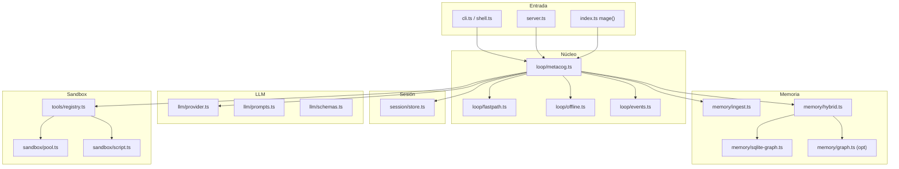

# Arquitectura de Mage

Documento de contexto para el equipo. Versión 0.3.0.

## Visión

Mage es un **kernel plan+verify**: produce un plan JSON (Zod), ejecuta tools con output tipado y solo responde si hay evidence. Sin rastro, `status: refused`. La memoria de producto es `Fact` ingestido (tenant + fuente), no el texto del modelo.

## Módulos



## Flujo de una consulta

1. **Sesión:** resolver o crear `sessionId` + `tenantId`; historial = resumen compactado + últimos 6 turnos.
2. **Fast path:** patrones determinísticos → WASM directo (~3 ms, 0 tokens LLM).
3. **Enrich:** hechos del tenant + grafo SQLite (Falkor opcional). Sin embeddings FNV si `embedProvider=none`.
4. **Plan:** LLM genera `Plan` JSON con `toolCalls`. `proposedAnswer` nunca es la respuesta.
5. **Sandbox:** ejecutar tools; output Zod; si fallan → corrección (hasta 3 intentos).
6. **Respuesta:** `finalizeResult` — sin evidence positiva → `refused`. `answer` sale del output parseado.
7. **Sesión:** append + compact (summary con factIds / evidence ids). El loop no persiste `memoryCandidates`.

## Decisiones de diseño

### ¿Por qué WASM + script.run separados?

| Capa | Uso | Latencia | Aislamiento |
|------|-----|----------|-------------|
| WASM (`calc`, `hash`, …) | Tools fijas, ultra-rápidas | ~2–5 ms | Extism, timeout 50 ms |
| `script.run` | Código arbitrario del LLM | ~10–500 ms | Subproceso Bun, opt-in |

WASM es el camino feliz para verificación numérica. `script.run` existe para algoritmos que el LLM inventa (quicksort, Fibonacci, etc.) pero **no debe habilitarse en producción pública** sin más aislamiento.

### ¿Por qué SQLite-first?

- Hola mundo sin Docker. Falkor solo si `MAGE_GRAPH=falkor` y el host responde.
- Hechos de dominio (`Fact`) con `tenantId` + `source`. El grafo demo es opcional.
- Vectores cloud solo si `MAGE_EMBED_PROVIDER` no es `none`.

### ¿Por qué sesiones SQLite + compaction?

- Reiniciar `mage serve` no borra el producto.
- Al pasar `sessionMaxTurns`, se persiste `summary` (factIds, lastStatus, lastEvidenceIds) y el prompt lleva eso + 6 turnos. No es un slice ciego.

### ¿Por qué `streamObject` y no `streamText`?

El output del LLM es un **objeto Zod** (`Plan`), no texto libre. `streamObject` permite emitir `plan_thought` incremental y eventos por fase sin parsear JSON a mano.

## Extension points

| Qué extender | Dónde | Cómo |
|--------------|-------|------|
| Nueva tool WASM | `wasm/toolkit.ts` → `bun run build:wasm` | AssemblyScript + registrar en `tools/builtin.ts` |
| Tool host (HTTP, archivos) | `tools/registry.ts` | Implementar `HostTool` |
| Fast path | `loop/fastpath.ts` | Nuevo regex + `runTool` |
| Offline fallback | `loop/offline.ts` | Patrón + `runScriptPlan` |
| Session store | `session/store.ts` | Implementar `SessionStore` |
| Provider LLM | `llm/provider.ts` | Añadir tier en `modelTiers` |

## API pública (`src/index.ts`)

```typescript
mage(query, { sessionId, onEvent, planOnly, runtime })
runMage(query, runtime, { sessionId, onEvent, signal })
runMageStream(query, runtime, { sessionId, signal })
createSession / getSession / deleteSession
getRuntime / createRuntime / startServer
```

## Límites conocidos

- `script.run` no es un sandbox de producción (default off).
- Free tier Gemini: poca cuota; usar stub, Ollama o fast path.
- FalkorDB opcional; el default es SQLite.
- Contradicciones de facts se rechazan; no hay merge semántico ni resolución de conflictos UI.

## Roadmap técnico

| Fase | Entregable |
|------|------------|
| 1–2 (actual) | Contrato evidence/refuse, wedge KPI, SQLite, auth, evals stub |
| 3 | Mage Cloud (grafo gestionado, dashboard) — no empezar hasta operar un wedge real |
